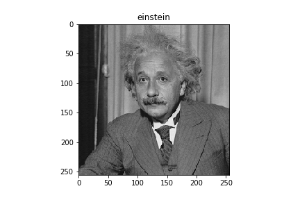
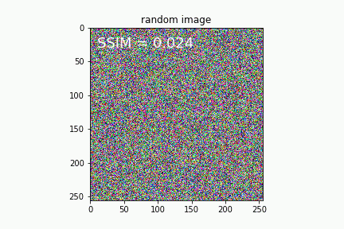
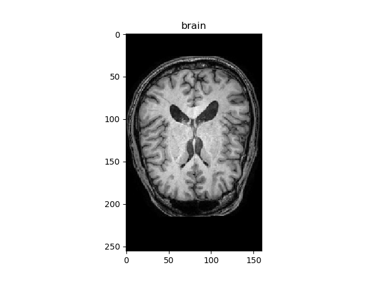
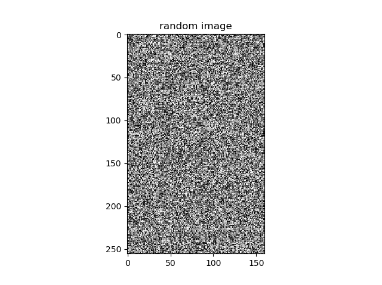
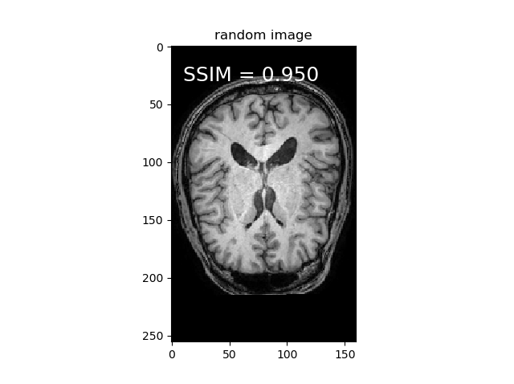

## chainer SSIM

Differentiable structural similarity (SSIM) index.

This repository is based on [Po-Hsun-Su/pytorch-ssim](https://github.com/Po-Hsun-Su/pytorch-ssim).

   

Code of generation Einstein from random image is [here](notebooks/optimize_einstein.ipynb)

Note that this code have not tested on cpu.


## Requirements

- chainer (6.0.0)
- cupy (6.0.0)


## How to use

Please see [baseline_demo.py](baseline_demo.py)  

```bash
python baseline_demo.py
```


## Difference between [baseline_demo.py](baseline_demo.py) and [structural_similarity2d_loss_demo.py](structural_similarity2d_loss_demo.py)?

It's just whether code use 1d decomposition for gaussian filter.

I recommend to use [structural_similarity2d_loss_demo.py](structural_similarity2d_loss_demo.py).  
Since it's fast :smile:


## 3D result

Please see [structural_similarity3d_loss_demo.py](structural_similarity3d_loss_demo.py)

```bash
python structural_similarity3d_loss_demo.py
```

||||
|:---:|:---:|:---:|
|Target image|Initial image|Reconstructed image|
||||

## Reference

- [The SSIM Index for Image Quality Assessment](https://ece.uwaterloo.ca/~z70wang/research/ssim/)

- [higumachan/ssim-chainer](https://github.com/higumachan/ssim-chainer)
